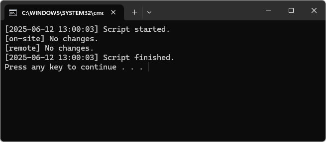
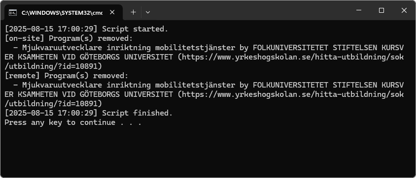

# YH Monitor (late applications)

This small script was originally written in summer 2025 while I was applying to Swedish *yrkeshögskola* programs.

I wanted an easy way to track Data/IT programs as *sen anmälan* (late application) spots were opening and closing throughout the summer.

The script fetches listings from **yrkeshogskolan.se**, saves them as daily CSV files, and shows what changed since yesterday.

## Prerequisites
- Python 3.10+
- `pip install -r requirements.txt`

## Usage

By default the script runs in **offline mode**, parsing saved HTML fixtures (located in `fixtures/onsite.html` and `fixtures/remote.html`).

This makes the project fully testable and safe to run in CI/CD pipelines.

To run against the real yrkeshogskolan.se site, use the `--live` flag:

```bash
python yh-monitor.py --live
```

The script writes CSV files into `./data/<category>/<YYYYMMDD>.csv.` 

Categories are on-site and remote.

(*In this project, `on-site` refers to programs located in Gothenburg.*)

## Screenshots

**No changes detected**



**Changes detected**




## Optional contact in User-Agent (live mode only)

If you run in **live mode**, you can optionally include a contact in the request headers by setting the environment variable `YH_CONTACT`.

This is a common courtesy: it allows site administrators to identify who is making automated requests if there are issues.

```powershell
$env:YH_CONTACT="name@example.com"
python yh-monitor.py --live
```

## CI/CD

This repository includes a GitHub Actions workflow:

- Runs on every push and pull request.
- Executes the test suite (`pytest`) against the offline HTML fixtures.
- Lints code with [`ruff`](https://github.com/astral-sh/ruff) and checks formatting with [`black`](https://github.com/psf/black).
- Uses a version matrix to confirm compatibility with Python 3.10, 3.11, and 3.12.
- Offline mode ensures CI is reproducible and never makes external requests.

## Manual live workflow

In addition to offline tests, the repository includes a **manual GitHub Actions workflow** (“Live scrape”).  
- The workflow can only be triggered by repository maintainers; it is not accessible to external visitors.  
- It runs the scraper in `--live` mode against yrkeshogskolan.se.  
- Results are saved as CSV files and uploaded as workflow artifacts (downloadable ZIPs).  
- This separation keeps CI/CD runs reproducible and safe, while still allowing ad-hoc live data collection.


## Notes

- The script is for educational/demo purposes.
- In live mode, it makes only a single request per category. Be considerate and do not schedule frequent runs against the site.
- In offline mode (default), it uses saved fixtures and does not perform any network requests.
